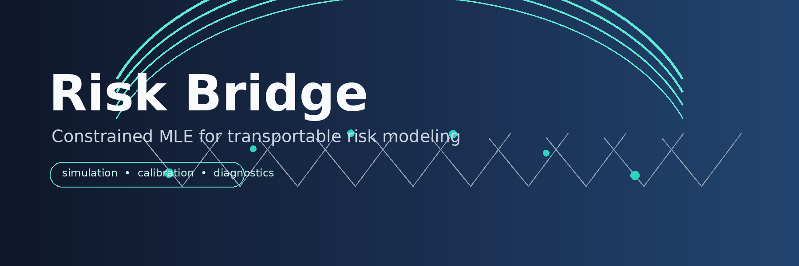

<p align="center">
  
</p>

# Risk Bridge

Risk Bridge is a Python package for estimating transportable binary-risk models when the available cohorts do not all contain the same information. It combines propensity-score sampling, reference-cohort calibration, maximum likelihood estimation, and constrained maximum likelihood estimation (cMLE) into reproducible simulation and user-data workflows.

Package title: **Risk Bridging through Constrained MLE**.

## Motivation

Risk models often need to be evaluated or adapted across related populations: a target cohort, a source cohort, and a reference cohort. Standard model fitting can drift when covariate distributions, calibration strata, or observed risk markers differ across those cohorts. Risk Bridge provides a repeatable way to compare ordinary ML estimates with calibration-constrained estimates while preserving diagnostics, thresholds, and run metadata.

## Foundation Papers

- > Cao, Y., Ma, W., Zhao, G., McCarthy, A. M., & Chen, J. (2024). A constrained maximum likelihood approach to developing well-calibrated models for predicting binary outcomes. Lifetime Data Analysis, 30(3), 624-648.
- > Wang, Le., Chen, J. (2026). Developing Accurate Risk Prediction Using Biased Electronic Health Record Data. Manuscript in preparation.

## Key features

- Simulated Scenario 1-3 workflows for reproducible method evaluation.
- User-data workflow for prepared target, source, and reference CSV datasets.
- Propensity-score matched and random-sampled source paths.
- Constrained MLE solver ladder with calibration-violation diagnostics.
- CSV-first output contract with optional parquet mirrors.
- Public Python API and `risk-bridge` command-line interface.
- Unit tests covering preprocessing, calibration, likelihoods, constraints, optimization, metrics, sampling, and pipeline behavior.

## Installation

### From the package index (standard path)

```bash
uv add risk-bridge
# or: pip install risk-bridge
```

The public-safe reproduction case runners are included in the wheel and source
distribution. After installation, run them with `python -m cases.<case>.<runner>`;
the same module commands work from a prepared source checkout.

### From a repository checkout

Risk Bridge is also packaged with `uv` and a checked-in lock file. To install `uv`, read [this](https://docs.astral.sh/uv/getting-started/installation/).

```bash
git clone git@github.com/SaehwanPark/risk-bridge.git
cd risk-bridge
uv sync --locked
```

Run the test suite:

```bash
uv run pytest
uv run basedpyright
```

The orchestration layer uses [`comp-builders`](https://pypi.org/project/comp-builders/) for explicit `Result` composition in recoverable validation paths. `uv sync --locked` installs it from the package index as recorded in `uv.lock`.

## Quick start

Run a small simulated scenario:

```bash
uv run risk-bridge \
  --mode simulated \
  --scenario 2 \
  --nsim 5 \
  --n-target 5000 \
  --n-source 2000 \
  --n-reference 5000 \
  --sample-size 500 \
  --output-root data \
  --run-label quickstart
```

Run on prepared CSV datasets:

```bash
uv run risk-bridge \
  --mode user-data \
  --target-csv /path/to/target.csv \
  --source-csv /path/to/source.csv \
  --reference-csv /path/to/reference.csv \
  --y-col label \
  --z-origin-col z_cont \
  --z-cat-col z_cat \
  --x-cols X1,X2,X3,X4 \
  --sample-size 500 \
  --nsim 1 \
  --output-root data \
  --run-label user_data
```

For a five-minute setup path, see [QUICKSTART.md](QUICKSTART.md).

## Architecture

```text
Input cohorts
  target, source, reference
        ⬇️
Preprocessing and schema validation
        ⬇️
Calibration artifacts from reference cohort
  risk strata, external prevalence, X-support
        ⬇️
Sampling paths
  propensity-score matched source + random source
        ⬇️
Model fitting
  ML baseline + cMLE with calibration constraints
        ⬇️
Evaluation and exports
  estimates, ROC metrics, accuracy metrics, diagnostics, metadata
```

The public CLI delegates to typed configuration objects in `risk_bridge.config`, orchestration in `risk_bridge.runs`, reusable pipeline helpers in `risk_bridge.pipeline`, and numerical components in `risk_bridge.likelihood`, `risk_bridge.constraints`, `risk_bridge.optimize`, and `risk_bridge.metrics`.

## Library usage

```python
from risk_bridge import UserDataRunConfig, UserDataSchema, run_user_data

run_dir = run_user_data(
  UserDataRunConfig(
    target_df=target_df,
    source_df=source_df,
    reference_df=reference_df,
    schema=UserDataSchema(
      x_cols=("X1", "X2", "X3", "X4"),
      y_col="label",
      z_origin_col="z_cont",
    ),
    sample_size=500,
    output_root="data",
    run_label="hospital_a",
  )
)
print(run_dir)
```

## Outputs

Each run writes a timestamped directory under `output_root` with `intermediate/` and `final/` folders. Start with these final outputs:

- `final/run_metadata.csv` (includes `schema_version`, currently `1.1.0`)
- `final/fit_diagnostics.csv`
- `final/est_cml_psm.csv`
- `final/calibration_metrics.csv`
- `final/calibration_residuals.csv`
- `final/roc_metrics.csv`
- `final/accuracy_metrics.csv`

## Reproduction

End-to-end regeneration commands for Scenario 2, numerical validation, external
calibration validation, the synthetic transport second example, and the
runtime/support-scaling protocol are in [REPRODUCTION.md](REPRODUCTION.md).
Cite this software with [CITATION.cff](CITATION.cff) (immutable v1.0.2 archive
DOI `10.5281/zenodo.21418590`, concept DOI `10.5281/zenodo.21401396`).

## Repository layout

```text
src/risk_bridge/  Python package source
tests/            Unit tests
cases/            Privacy-safe replication harnesses
examples/         Minimal runnable examples
docs/             Supplementary documentation
assets/           README visual assets
```

## Documentation

- [Quickstart](QUICKSTART.md)
- [Reproduction runbook](REPRODUCTION.md)
- [Contributing](CONTRIBUTING.md)
- [User guide](USER_GUIDE.md)
- [API reference](API_REFERENCE.md)
- [Architecture overview](ARCHITECTURE.md)
- [Pipeline architecture](docs/architecture/python_pipeline_analysis.md)
- [Solver strategy](docs/architecture/python_solver_strategy.md)
- [Replication cases](cases/README.md)
- [Changelog](CHANGELOG.md)
- [Citation](CITATION.cff)
- [License](LICENSE)

## License

Risk Bridge is released under the Apache License 2.0.
